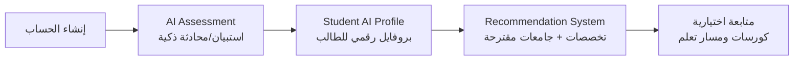
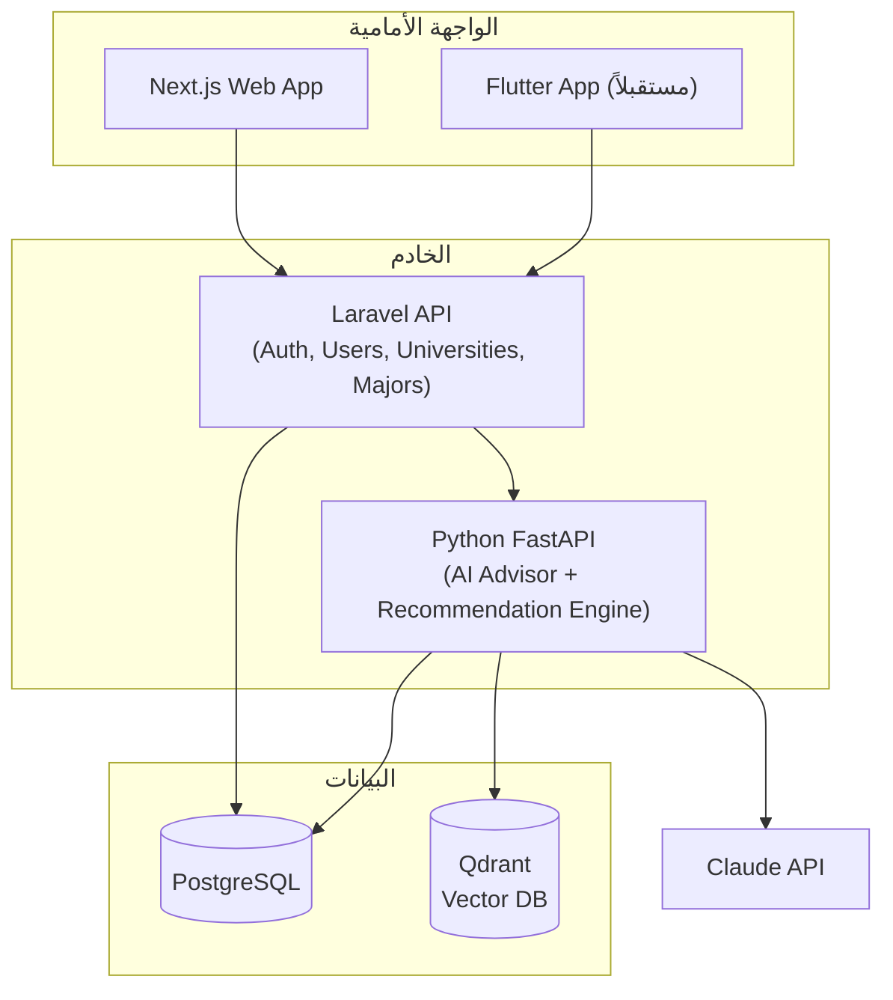
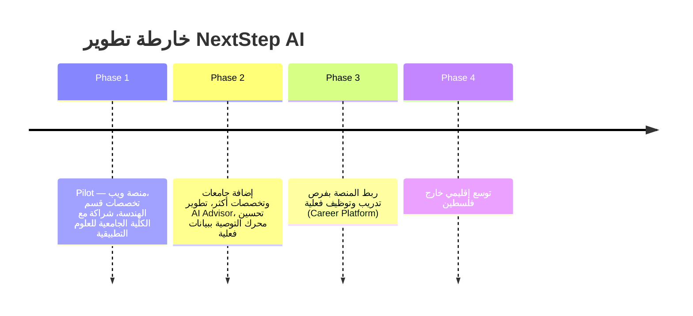

<div align="center">

# 🎓 NextStep AI

### منصة ذكية للإرشاد الأكاديمي والمهني بالذكاء الاصطناعي
### AI-Powered Academic & Career Guidance Platform

منصة رقمية تساعد طلاب الثانوية والطلاب الجامعيين في فلسطين على اتخاذ قرارات أكاديمية ومهنية مبنية على بيانات حقيقية وتحليل ذكي، بدل الاعتماد على العشوائية أو آراء الآخرين.

[]()
[]()
[]()

[نظرة عامة](#-نظرة-عامة) •
[المشكلة](#-المشكلة) •
[الحل](#-الحل) •
[التقنيات](#%EF%B8%8F-التقنيات-المستخدمة) •
[البدء السريع](#-البدء-السريع) •
[الفريق](#-الفريق) •
[خارطة الطريق](#-خارطة-الطريق)

</div>

---

## 📌 نظرة عامة

**NextStep AI** هي منصة ذكية تعمل حالياً على الويب (مع خطة مستقبلية لتطبيق موبايل)، تهدف إلى مساعدة **طلاب الثانوية** و**الطلاب الجامعيين** في اتخاذ قرارات أكاديمية ومهنية صحيحة، باستخدام الذكاء الاصطناعي وتحليل البيانات.

تربط المنصة بين:

| 🧑‍🎓 الطالب | 🏛️ الجامعات والكليات | 📚 التخصصات الأكاديمية | 💼 سوق العمل |
|:---:|:---:|:---:|:---:|

بحيث تتحول رحلة الطالب من **اختيار عشوائي** إلى **مسار مبني على البيانات والتحليل الذكي**.

> **الرؤية**: أن تصبح NextStep AI المنصة الأولى في فلسطين التي تستخدم الذكاء الاصطناعي لتوجيه الطلاب أكاديمياً ومهنياً، وربط التعليم الجامعي باحتياجات سوق العمل.

> **الرسالة**: تمكين كل طالب من معرفة التخصص الأنسب له، وأين يمكنه دراسته، وماذا يحتاج ليتطور، وكيف يبني مساره المهني — من خلال تجربة ذكية وشخصية تعتمد على البيانات.

يبدأ المشروع بمرحلة تجريبية **(Pilot)** بالشراكة مع الكلية الجامعية للعلوم التطبيقية، على أن يتوسع لاحقاً ليشمل جامعات وتخصصات إضافية.

---

## 🧩 المشكلة

### طلاب ما بعد الثانوية
- اختيار تخصص غير مناسب لقدراتهم أو ميولهم.
- نقص حاد في المعلومات الدقيقة عن الجامعات والتخصصات.
- الاعتماد على آراء العائلة أو الأصدقاء بدل بيانات موضوعية.
- غياب رؤية واضحة عن مستقبل التخصص في سوق العمل.

### الطلاب الجامعيون
- غياب إرشاد أكاديمي مستمر بعد القبول.
- صعوبة معرفة المهارات والكورسات المطلوبة لتعزيز فرصهم.
- ضعف الربط العملي بين التخصص واحتياجات سوق العمل.

### الجامعات
- صعوبة الوصول للطلاب الجدد بطريقة ذكية ومبنية على بيانات.
- غياب منصة موحدة تعرض برامجها بشكل تفاعلي.
- نقص أدوات لفهم اهتمامات وتوجهات الطلاب.

### 💙 البعد الإنساني
في ظل الظروف الاستثنائية التي يمر بها قطاع التعليم في غزة، تتضاعف الحاجة لأدوات ترشد الطلاب بأقل جهد وأعلى دقة. NextStep AI لا تقدّم توصية تقنية فقط، بل تمنح كل طالب — بغض النظر عن ظروفه أو إمكانية وصوله لإرشاد مباشر — فرصة متكافئة للحصول على توجيه مبني على بيانات حقيقية، **مجانية بالكامل في نسختها الأساسية**.

---

## 💡 الحل

توفر NextStep AI نظاماً متكاملاً يشمل:

1. 🏫 **منصة استكشاف الجامعات والتخصصات**
2. 🧠 **نظام تحليل شخصية وميول الطالب** (AI Assessment)
3. 🎯 **نظام توصية ذكي للتخصصات والجامعات** بنسبة توافق واضحة
4. 🤖 **مساعد أكاديمي بالذكاء الاصطناعي** (AI Advisor)
5. 📈 **نظام توصية بالكورسات والشهادات** (ميزة مدفوعة اختيارية)
6. 📊 **لوحة تحليلات (Dashboard)** للجامعات لفهم توجهات الطلاب

### رحلة الطالب داخل المنصة



| المرحلة | الوصف |
|---|---|
| **1. إنشاء الحساب** | الاسم، العمر، المدينة، المعدل، الفرع الدراسي |
| **2. AI Assessment** | تحليل الجانب الأكاديمي، المهارات، الاهتمامات، والشخصية |
| **3. Student AI Profile** | بناء ملف ذكي يوضح نقاط قوة الطالب واهتماماته ونسب توافقه مع التخصصات |
| **4. Recommendation System** | اقتراح تخصصات وجامعات مناسبة حسب المعدل، الموقع، وتوفر التخصص |
| **5. المتابعة (اختيارية)** | اقتراح كورسات وخطة تعلم مخصصة بعد اختيار التخصص |

---

## 👥 المستخدمون المستهدفون

| الفئة | الهدف |
|---|---|
| 🎓 طلاب الثانوية العامة | اختيار تخصص وجامعة مناسبة بثقة |
| 📘 الطلاب الجامعيون | تطوير المسار الأكاديمي والمهني أثناء الدراسة |
| 🏛️ الجامعات والكليات | عرض برامجها، وفهم اهتمامات الطلاب عبر بيانات حقيقية |
| ⚙️ إدارة المنصة | إدارة المحتوى والتحكم الكامل بالنظام |

---

## 🤖 دور الذكاء الاصطناعي

| المكوّن | الوظيفة |
|---|---|
| **AI Academic Advisor** | مساعد أكاديمي شخصي يجيب عن الأسئلة، يشرح التخصصات والمساقات، ويقترح مسار تعلم |
| **AI Recommendation Engine** | يقترح تخصصات، جامعات، كورسات، شهادات، ومشاريع |
| **AI Career Guidance** | يوضح للطالب الوظائف المحتملة، المهارات المطلوبة، وطريق التطور |
| **AI Analytics** | تحليل توجهات الطلاب وأكثر التخصصات طلباً للجامعات وصناع القرار |

### منطق التوصية (النسخة الأولى)
تُبنى النسخة الأولى على نظام **Weighted Matching** بسيط وقابل للشرح بالكامل (بدل نموذج تعلّم آلي مُدرّب، لغياب بيانات تاريخية كافية حالياً):

- كل تخصص له بروفايل من **6 أبعاد** (برمجة، رياضيات، تواصل، بحث علمي، عملي، إدارة) بقيم من 0–1، تُحدَّد بالتنسيق المباشر مع أساتذة الكلية.
- الطالب يحصل على نفس الأبعاد من إجاباته على الاستبيان الذكي.
- **نسبة التوافق = درجة التشابه** بين بروفايل الطالب وبروفايل كل تخصص.

قابل للترقية لاحقاً إلى نموذج تعلّم آلي حقيقي عند توفر بيانات كافية.

---

## 🏗️ التقنيات المستخدمة

<div align="center">

| الطبقة | التقنية | السبب |
|---|---|---|
| **Frontend (Web)** | React / Next.js | تطوير سريع وأداء جيد لصفحات الجامعات والتخصصات |
| **Frontend (Mobile)** | Flutter | *(مخطط لمرحلة لاحقة)* |
| **Backend** | Laravel (PHP API) | متوافق مع خبرة الفريق الحالية |
| **AI Service** | Python (FastAPI) | يفصل منطق التوصية والمساعد الذكي عن الباكند الأساسي |
| **Language Model** | Claude API (أو مزود مكافئ) | للمساعد الأكاديمي وشرح التخصصات اعتماداً على بيانات الكلية |
| **Database** | PostgreSQL | متينة وكافية لحجم البيانات الحالي والمستقبلي |
| **Vector Database** | Qdrant | لدعم البحث الدلالي (RAG) |

</div>

### البنية العامة للنظام



---

## 🗂️ هيكل المشروع (مقترح)

> ⚠️ هذا الهيكل مقترح بناءً على البنية التقنية الموثّقة للمشروع. رجاءً حدّثه ليطابق البنية الفعلية لمجلدات الريبو بعد رفع الكود.

```
NextStwp_Ai/
├── frontend/               # تطبيق الويب (Next.js)
│   ├── app/ or pages/
│   ├── components/
│   └── public/
├── backend/                # Laravel API
│   ├── app/
│   ├── routes/
│   └── database/
├── ai-service/              # خدمة الذكاء الاصطناعي (FastAPI)
│   ├── app/
│   │   ├── recommendation/  # Weighted Matching Engine
│   │   ├── advisor/         # AI Academic Advisor (RAG)
│   │   └── analytics/
│   └── requirements.txt
├── docs/                   # وثائق المشروع (Blueprint, Vision Doc...)
└── README.md
```

---

## 🚀 البدء السريع

### المتطلبات الأساسية

- Node.js (v18+) — للواجهة الأمامية
- PHP (v8.2+) و Composer — للباكند (Laravel)
- Python (v3.10+) — لخدمة الذكاء الاصطناعي
- PostgreSQL
- مفتاح API لنموذج اللغة (Claude API أو مزود مكافئ)

### التثبيت

```bash
# 1. استنساخ المستودع
git clone https://github.com/omar-hamdia/NextStwp_Ai.git
cd NextStwp_Ai

# 2. إعداد الواجهة الأمامية
cd frontend
npm install
npm run dev

# 3. إعداد الباكند (Laravel)
cd ../backend
composer install
cp .env.example .env
php artisan key:generate
php artisan migrate
php artisan serve

# 4. إعداد خدمة الذكاء الاصطناعي (FastAPI)
cd ../ai-service
python -m venv venv
source venv/bin/activate   # على Windows: venv\Scripts\activate
pip install -r requirements.txt
uvicorn app.main:app --reload
```

### متغيرات البيئة (مثال)

```env
# Backend (.env)
DB_CONNECTION=pgsql
DB_HOST=127.0.0.1
DB_PORT=5432
DB_DATABASE=nextstep_ai
DB_USERNAME=postgres
DB_PASSWORD=

# AI Service (.env)
LLM_API_KEY=your_api_key_here
QDRANT_URL=http://localhost:6333
```

> 📝 عدّل الأوامر أعلاه لتطابق سكربتات الـ package.json / composer.json الفعلية في الريبو.

---

## 📦 النسخة الأولى (MVP)

**المدة المقترحة:** 3 أشهر

<table>
<tr><th>Student</th><th>University</th><th>AI</th></tr>
<tr valign="top">
<td>

- ✔ تسجيل دخول
- ✔ Profile
- ✔ اختبار AI
- ✔ توصية تخصصات
- ✔ صفحات الجامعات
- ✔ صفحات التخصصات الأساسية

</td>
<td>

- ✔ إنشاء صفحة جامعة
- ✔ إدارة المحتوى
- ✔ إضافة التخصصات

</td>
<td>

- ✔ Chat Assistant
- ✔ Recommendation System أولي
- ✔ تحليل الاستبيان

</td>
</tr>
</table>

### جدول تنفيذ الـ Pilot (6–8 أسابيع)

| الأسبوع | المخرجات |
|---|---|
| 1 | جمع البيانات من الكلية، تصميم الاستبيان الذكي، تحديد Schema قاعدة البيانات |
| 2 | بناء أساس الـ Backend: تسجيل الدخول، جداول الجامعات/التخصصات، لوحة إدارة بسيطة |
| 2–3 | بناء الفرونت إند: التسجيل، الملف الشخصي، صفحات الكلية والتخصصات |
| 3–4 | بناء محرك التوصية (Weighted Scoring) وربطه بواجهة الطالب |
| 4–5 | بناء المساعد الأكاديمي الذكي (AI Advisor) وربطه ببيانات التخصصات الفعلية |
| 5–6 | التكامل الكامل بين الأجزاء، اختبار السيناريو الكامل ببيانات حقيقية |
| 6–8 | الإطلاق التجريبي مع دفعة الطلاب الجدد، وجمع ملاحظات للتحسين |

---

## ☁️ خطة النشر (Deployment)

| المكوّن | أداة النشر المقترحة | ملاحظات |
|---|---|---|
| الواجهة الأمامية (Next.js) | Vercel | نشر مباشر من GitHub، خطة مجانية كافية لمرحلة الـ Pilot |
| الخادم (Laravel API) | Railway / Render | استضافة سحابية بسيطة الإعداد ومناسبة للبدايات |
| خدمة الذكاء الاصطناعي (FastAPI) | نفس مزود الباكند أو خدمة منفصلة | خفيفة يمكن فصلها لاحقاً عند زيادة الحمل |
| قاعدة البيانات | PostgreSQL مُدارة (Managed) | نسخ احتياطي تلقائي لحماية بيانات الجامعة والطلاب |
| إدارة الكود | Git Flow + GitHub | فرع رئيسي (main) + فروع تطوير لكل ميزة |

---

## 💰 نموذج العمل

النسخة الأساسية من المنصة **مجانية بالكامل** للطالب. الإيرادات تأتي من:

1. **اشتراكات الجامعات (B2B)** — اشتراك سنوي مقابل صفحة رسمية، Dashboard، ونظام إرشاد للطلاب.
2. **الشراكات التعليمية** — نسبة من التسجيلات المُحالة لمراكز تدريب ومنصات تعليمية شريكة.
3. **ميزات مدفوعة اختيارية (Premium)** — متابعة مخصصة للكورسات واقتراح خطة تعلم تفصيلية، دون أن تكون شرطاً لاستخدام المنصة.

---

## 🗺️ خارطة الطريق



---

## ⚠️ المخاطر والتحديات الرئيسية

| المخاطرة | كيفية التعامل معها |
|---|---|
| بطء أو محدودية جمع البيانات من الجامعة | البدء بأقل بيانات كافية للتشغيل (تخصص واحد)، والتوسع تدريجياً بالتوازي مع التطوير |
| دقة نظام التوصية بدون بيانات تاريخية | استخدام Weighted Matching قابل للشرح، ومراجعته يدوياً مع الكلية قبل الإطلاق |
| ارتفاع تكلفة استخدام LLM API | مراقبة الاستهلاك أولاً بأول، وضبط حدود استخدام معقولة لكل طالب |
| ضيق الوقت قبل استقبال الطلاب الجدد | تضييق نطاق الـ Pilot لويب فقط، وتحديد أولويات واضحة أسبوعياً |

---

## 🧑‍💻 الفريق

| الاسم | الدور | المهام الأساسية |
|---|---|---|
| **أحمد الحايك** | CEO / AI Product Lead | قيادة المشروع، إدارة المنتج، التواصل مع الجامعات، تحديد بروفايلات التخصصات، AI Integration |
| **عيد أبو بيض** | CTO / AI Engineer | تصميم النظام، خدمات الذكاء الاصطناعي، RAG، Integration، النشر |
| **مريم تابيل** | Frontend Engineer | تصميم الواجهات، تطبيق الويب، صفحات الطالب والجامعة |
| **مرح الزنط** | Data Analyst / AI | تحديد بروفايلات التخصصات، تصميم الاستبيانات، التحليلات، منطق التوصية |
| **عمر حمدية**| Backend Engineer | Laravel Backend، قاعدة البيانات، الـ APIs، نظام الدخول ولوحة الإدارة |
| **نداء المدهون** | Information Security Specialist | حماية بيانات الطلاب والجامعات، مراجعة الثغرات الأمنية، تأمين الـ APIs والمصادقة، سياسات الخصوصية والامتثال |

---

## 🎯 الهدف النهائي

> **NextStep AI ليست منصة معلومات فقط، بل نظام ذكاء اصطناعي يرافق الطالب من لحظة اختيار التخصص حتى بناء مستقبله المهني — بأداة مجانية الأساس، مبنية على بيانات حقيقية، وقابلة للنمو تدريجياً مع كل شراكة جديدة.**

---

## 🤝 المساهمة

هذا المشروع في مرحلة تطوير مبكرة (Pilot). إذا كنت مهتماً بالمساهمة:

1. اعمل Fork للمستودع
2. أنشئ فرعاً جديداً لميزتك (`git checkout -b feature/AmazingFeature`)
3. قم بعمل Commit للتغييرات (`git commit -m 'Add some AmazingFeature'`)
4. ادفع الفرع (`git push origin feature/AmazingFeature`)
5. افتح Pull Request

---

## 📄 الترخيص

جميع الحقوق محفوظة لفريق NextStep AI. للاستفسارات حول الترخيص أو الشراكات، يرجى التواصل مع الفريق.

---

## 📬 التواصل

للاستفسارات أو الشراكات (خصوصاً مع الجامعات والكليات)، يمكن التواصل مع فريق **NextStep AI** عبر صفحة المستودع على GitHub.

<div align="center">

**صُنع بـ ❤️ لدعم الطلاب في فلسطين**

</div>
# NextStep-AI

